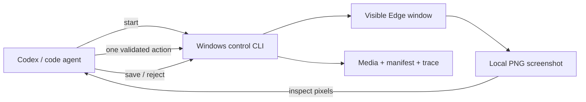

# Windows Visual Image Scraper Skill

[](LICENSE)

A reusable Codex skill for extracting visible images through a real Microsoft Edge window on Windows. Codex—or another code agent that can inspect local images—provides the visual intelligence. The bundled Node.js and PowerShell scripts only expose bounded browser controls, screenshots, crops, deduplication, and audit artifacts.

**No OpenAI SDK, separate API key, or model configuration is required.** The skill uses the model already running in Codex. Its scripts do not send screenshots to an AI API.

It is intended for cases where authentication, client-side rendering, or a visual-only interface makes direct downloads impractical. It does not use Playwright, Selenium, DOM selectors, cookie export, or browser-profile copying.

> [!IMPORTANT]
> This project controls a visible desktop. It can take focus and briefly move the pointer. Run it inside a dedicated Windows VM when the main desktop must remain usable. A VM isolates the desktop; it does not hide automation or prevent website rate limits, challenges, or account enforcement.

## How it works



The agent and scripts have deliberately separate jobs:

- The agent inspects each returned PNG and decides what is visibly true.
- Workflow JSON constrains allowed actions, keys, step counts, crop policy, and acceptance criteria.
- The CLI executes one action at a time against the Edge window saved in `session.json`.
- PowerShell uses native Windows screenshot and input APIs.
- Accepted images are cropped locally and deduplicated with SHA-256.
- `manifest.json` and `run.ndjson` preserve an auditable record.

There is no hidden autonomous model loop inside the CLI. This is what makes the repository usable directly by Codex and other image-capable coding agents without separate credentials.

## Requirements

- Windows 10 or Windows 11 with an interactive, unlocked desktop.
- Microsoft Edge.
- Node.js 20 or newer.
- PowerShell 5.1 or newer.
- Codex or another code agent capable of opening local PNG screenshots.

The repository currently has no npm runtime dependencies.

## Install as a Codex skill

Codex discovers personal skills under `.agents/skills` in the user's profile:

```powershell
$skillDirectory = Join-Path $env:USERPROFILE ".agents\skills\windows-visual-image-scraper"
git clone https://github.com/arturhc/windows-visual-image-scraper.git $skillDirectory
npm ci --prefix $skillDirectory
node "$skillDirectory\scripts\image-scraper.mjs" doctor
```

Restart Codex if the skill does not appear immediately. Then invoke it explicitly, for example:

```text
$windows-visual-image-scraper capture five still images from this gallery URL
```

The skill can also be installed from this repository with Codex's `$skill-installer`.

## Quick start for agents

First resolve and validate the plan without touching the desktop:

```powershell
node scripts/image-scraper.mjs start `
  --preset generic-lightbox-gallery `
  --url "https://example.com/gallery" `
  --count 3 `
  --dry-run
```

Start the visible session only after the user authorizes desktop control:

```powershell
node scripts/image-scraper.mjs start `
  --preset generic-lightbox-gallery `
  --url "https://example.com/gallery" `
  --count 3 `
  --output ".\captures" `
  --pause-for-login `
  --confirm-live-ui
```

`start` returns JSON containing `sessionPath`, `screenshotPath`, and instructions for the first stage. The agent must inspect that PNG, then issue one action:

```powershell
node scripts/image-scraper.mjs act `
  --session "C:\captures\...\session.json" `
  --context open-first-image `
  --click "0.25,0.55"
```

Every `act` returns the next screenshot. When the stage is visibly complete:

```powershell
node scripts/image-scraper.mjs act `
  --session "C:\captures\...\session.json" `
  --context open-first-image `
  --done
```

Capture and evaluate the collection frame:

```powershell
node scripts/image-scraper.mjs shot `
  --session "C:\captures\...\session.json" `
  --context collection
```

After inspecting the PNG, save a precisely selected crop or reject it:

```powershell
node scripts/image-scraper.mjs save `
  --session "C:\captures\...\session.json" `
  --input "C:\captures\...\screenshots\004-collection.png" `
  --crop-box "0.05,0.08,0.74,0.95"

node scripts/image-scraper.mjs reject `
  --session "C:\captures\...\session.json" `
  --input "C:\captures\...\screenshots\004-collection.png" `
  --reason "The visible media is a video" `
  --media-type video
```

Advance according to the returned workflow instructions, then inspect the new PNG:

```powershell
node scripts/image-scraper.mjs act `
  --session "C:\captures\...\session.json" `
  --context collection `
  --key RIGHT
```

Always finish the session so fullscreen and the created window are cleaned up:

```powershell
node scripts/image-scraper.mjs finish `
  --session "C:\captures\...\session.json" `
  --status complete
```

Use `partial` if some images were saved but the requested count was not reached, and `failed` when none were usable.

## Capture page viewports

For deterministic screenshots that do not require agent decisions:

```powershell
node scripts/image-scraper.mjs capture-page `
  --url "https://example.com" `
  --shots 3 `
  --step-pages 1 `
  --output ".\captures" `
  --confirm-live-ui
```

## Bundled workflows

| Preset | Intended surface | Advance strategy |
| --- | --- | --- |
| `generic-lightbox-gallery` | Conventional thumbnail gallery and single-image viewer | Right Arrow |
| `facebook-photos` | Profile owner-photo grid and dark photo viewer | Right Arrow |
| `instagram-photo-posts` | Post modal, accepting still images and rejecting video | Agent locates the outer next-post control |

Website layouts change. Facebook and Instagram workflows are bounded starting points, not compatibility guarantees.

## Output and resumable sessions

Each run creates an isolated directory:

```text
<output>/<workflow-or-page>/<timestamp>/
├── session.json       # active agent session and target Edge window
├── manifest.json      # accepted and rejected items; source of truth
├── run.ndjson         # timestamped actions and events
├── media/             # accepted images
├── screenshots/       # frames returned to the agent
├── trace/
└── raw/               # temporary crop candidates
```

`status --session PATH` can inspect a session without operating the UI. `finish` is idempotent. Input images passed to `save` or `reject` must live inside that session's run directory.

Deduplication is byte-exact after cropping; visually similar images with different pixels can remain distinct.

## Safety boundaries

- Only `click`, `key`, `wait`, and `done` actions exist.
- Clicks use window-relative ratios from `0` through `1` and remain inside the created Edge window.
- Keyboard input is restricted by the active workflow and a fixed safe-key allowlist.
- Per-stage and global action/screenshot limits prevent unbounded loops.
- Workflows cannot contain shell commands, JavaScript, arbitrary PowerShell, credentials, or account-specific URLs.
- The runner only accepts crop inputs located within the session directory.
- A live opening command always requires `--confirm-live-ui`.
- Authentication is manual; the project never reads cookies, passwords, or browser profile files.

Stop when a page shows a CAPTCHA, account checkpoint, security prompt, consent change, or rate-limit message. Do not use this project to bypass access controls or collect content you are not authorized to access.

## VM and resolution behavior

For desktop isolation, install and run Codex/the code agent, this skill, Edge, Node.js, and PowerShell inside the same persistent Windows VM. Keep the VM console rendered and unlocked.

Clicks and crop boxes use ratios, so the system is not tied to one fixed resolution. A stable VM resolution and display scale still improve repeatability because layouts can reflow, controls can move, and responsive breakpoints can change what is visible. See [VM setup](references/vm-setup.md).

## Custom workflows

Copy `scripts/workflows/generic-lightbox-gallery.json`, edit goals and constraints, then validate it:

```powershell
node scripts/image-scraper.mjs validate-workflow --workflow ".\my-gallery.json"
node scripts/image-scraper.mjs start --workflow ".\my-gallery.json" --url "https://example.com" --dry-run
```

See the [workflow schema](references/workflow-schema.md) and [CLI reference](references/cli.md).

## Development

```powershell
npm ci
npm run check
npm run validate:workflows
npm run doctor
```

Automated tests are offline: they do not open Edge, move the pointer, press keys, or contact an AI service. `doctor` inspects the local runtime without launching a browser window.

## Project layout

```text
SKILL.md                         Codex instructions and agent loop
agents/openai.yaml               Skill UI metadata
scripts/image-scraper.mjs        CLI entrypoint
scripts/lib/agent-session.mjs    Agent-native session protocol
scripts/lib/                     Artifacts, workflow, and Windows bridges
scripts/windows/                 Native PowerShell helper
scripts/workflows/               Bundled JSON workflows
references/                      CLI, schema, runtime, and VM guidance
tests/                           Offline Node.js tests
```

## Resumen en español

Esta skill no necesita una API key adicional. Codex ve cada captura local y decide una sola acción; los scripts únicamente controlan Edge, recortan, deduplican y generan evidencia. No usa Playwright ni Selenium. Si no quieres perder el mouse o teclado de tu computadora principal, ejecútala completa dentro de una VM de Windows persistente.

## License

MIT. See [LICENSE](LICENSE).
