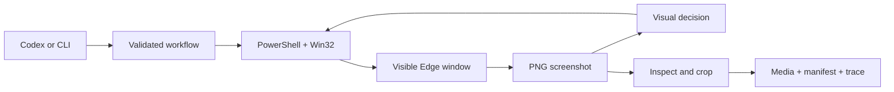

# Windows Visual Image Scraper Skill

[](LICENSE)

A reusable Codex skill and Windows CLI that captures visible page viewports or extracts still images from browser-rendered galleries through a real Microsoft Edge window.

It was designed for cases where authentication, client-side rendering, or a visual-only interface makes direct HTTP downloads impractical. It does not use Playwright, Selenium, DOM selectors, cookie export, or browser-profile copying.

> [!IMPORTANT]
> This project automates visible browser interaction. It can take focus and briefly move the pointer on the Windows machine where it runs. A dedicated Windows VM is recommended when the host desktop must remain usable. A VM provides isolation, not immunity from website rules, rate limits, or account enforcement.

## What it does

- Opens a separate Edge window with a user-selected local profile.
- Captures the visible window with native Windows APIs.
- Uses constrained visual reasoning to choose safe gallery-navigation actions.
- Accepts still images while rejecting videos, grids, feeds, placeholders, and ambiguous frames.
- Crops the visible image with model-provided ratios or a local pixel heuristic.
- Rejects exact duplicate output using SHA-256 hashes.
- Writes a timestamped manifest, NDJSON decision log, raw frames, and trace screenshots.
- Closes only the Edge window created for the run unless `--keep-open` is selected.



## Requirements

- Windows 10 or Windows 11 with an interactive, unlocked desktop.
- Microsoft Edge.
- Node.js 20 or newer.
- PowerShell 5.1 or newer.
- `OPENAI_API_KEY` for visual extraction workflows.

The `capture-page` command does not use the OpenAI API.

## Install as a Codex user skill

Codex discovers personal skills under `.agents/skills` in the user's profile. From PowerShell:

```powershell
$skillDirectory = Join-Path $env:USERPROFILE ".agents\skills\windows-visual-image-scraper"
git clone https://github.com/arturhc/windows-visual-image-scraper.git $skillDirectory
npm ci --prefix $skillDirectory
node "$skillDirectory\scripts\image-scraper.mjs" doctor
```

Restart Codex if the skill does not appear immediately. Invoke it explicitly with:

```text
$windows-visual-image-scraper capture five still images from this gallery URL
```

The skill can also be installed from this GitHub repository using Codex's `$skill-installer`.

## Quick start

Clone for standalone CLI use:

```powershell
git clone https://github.com/arturhc/windows-visual-image-scraper.git
Set-Location windows-visual-image-scraper
npm ci
npm run doctor
```

List the bundled workflows:

```powershell
npm run list-presets
```

Validate a command without opening Edge or generating input:

```powershell
node scripts/image-scraper.mjs run `
  --preset generic-lightbox-gallery `
  --url "https://example.com/gallery" `
  --count 3 `
  --dry-run
```

Capture sequential page viewports:

```powershell
node scripts/image-scraper.mjs capture-page `
  --url "https://example.com" `
  --shots 3 `
  --step-pages 1 `
  --output ".\captures" `
  --confirm-live-ui
```

Run a visual extraction workflow:

```powershell
node scripts/image-scraper.mjs run `
  --preset generic-lightbox-gallery `
  --url "https://example.com/gallery" `
  --count 3 `
  --output ".\captures" `
  --pause-for-login `
  --confirm-live-ui
```

Live execution always requires `--confirm-live-ui`. Authentication remains manual.

## Bundled workflows

| Preset | Intended surface | Advance strategy |
| --- | --- | --- |
| `generic-lightbox-gallery` | Conventional thumbnail gallery and single-image viewer | Right Arrow |
| `facebook-photos` | A profile's own-photo grid and dark photo viewer | Right Arrow |
| `instagram-photo-posts` | Profile post modal, accepting still images and skipping video | Visually located outer next-post control |

Website layouts change. Treat the Facebook and Instagram presets as bounded starting points, not a compatibility guarantee.

## Output

Each execution creates an isolated run directory:

```text
<output>/<workflow-or-page>/<timestamp>/
├── manifest.json
├── run.ndjson
├── media/
├── screenshots/
├── trace/
└── raw/
```

`manifest.json` is the source of truth. Its status is `complete`, `partial`, or `failed`. Every accepted image includes its relative path, SHA-256 hash, crop method, refinement state, and inspection confidence.

Deduplication is byte-exact after cropping; visually similar images with different pixels may remain distinct.

## Safety model

The workflow format is intentionally limited:

- Only `click`, `key`, `wait`, and `done` actions are accepted.
- Clicks use window-relative ratios and must remain inside the created Edge window.
- Keyboard input is restricted to a small whitelist.
- Workflows cannot execute shell commands, arbitrary PowerShell, JavaScript, URLs, or filesystem operations.
- The visual planner is instructed never to operate account, privacy, checkout, messaging, deletion, upload, consent, or browser-navigation controls.
- The runner stops on errors and records partial artifacts instead of silently claiming success.

Do not use this project to bypass access controls, CAPTCHAs, checkpoints, rate limits, or a site's terms. Collect only content you are authorized to access and retain.

## Dedicated VM

For isolation, install and execute the entire project inside a persistent Windows VM. The Edge process and the CLI must live in the same guest operating system.

See [Dedicated Windows VM setup](references/vm-setup.md) for display, RDP, shared-folder, and first-run guidance.

## Custom workflows

New sites normally require only a JSON workflow, not new Windows automation code. Start from `scripts/workflows/generic-lightbox-gallery.json`, then validate it:

```powershell
node scripts/image-scraper.mjs validate-workflow --workflow ".\my-gallery.json"
node scripts/image-scraper.mjs run --workflow ".\my-gallery.json" --url "https://example.com" --dry-run
```

See [Workflow schema](references/workflow-schema.md) for every field and invariant. See [CLI reference](references/cli.md) for all options and environment variables.

## Development

```powershell
npm ci
npm run check
npm run validate:workflows
npm run doctor
```

Tests do not open Edge, move the pointer, press keys, or call the OpenAI API. `doctor` inspects the local runtime without launching a browser window.

## Project layout

```text
SKILL.md                         Codex instructions and routing
agents/openai.yaml               UI metadata and invocation policy
scripts/image-scraper.mjs        CLI entrypoint
scripts/lib/                     Workflow, vision, artifacts, and Windows bridge
scripts/windows/                 Native PowerShell helper
scripts/workflows/               Bundled JSON presets
references/                      CLI, schema, runtime, and VM guidance
tests/                           Offline Node.js tests
```

## License

MIT. See [LICENSE](LICENSE).

## Resumen en español

Esta skill captura imágenes mediante una ventana real y visible de Microsoft Edge en Windows. No usa Playwright ni Selenium. Para no perder el control del mouse y teclado de tu computadora principal, ejecútala dentro de una VM de Windows persistente. La VM aísla el escritorio, pero no elimina los riesgos de automatizar una cuenta ni autoriza el scraping de contenido ajeno.
