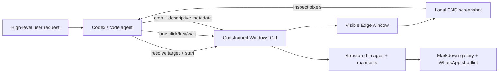

# Windows Visual Image Scraper Skill

[](LICENSE)

A reusable Codex skill for end-to-end image collection from Facebook profiles, Instagram profiles, and browser galleries through a real Microsoft Edge window on Windows.

The intended user experience is high level:

```text
Use $windows-visual-image-scraper. Here are a Facebook profile and an Instagram
profile. Collect useful images and leave everything in a structured folder.
```

Codex handles target resolution, visible navigation, screenshot inspection, clicking, cropping, descriptive filenames, curation, WhatsApp recommendations, cleanup, and the final Markdown report. The user does not need to provide coordinates or operate the browser.

**No OpenAI SDK, separate API key, or model configuration is required.** The skill uses the visual intelligence of the Codex/code-agent session that is already running. Its scripts do not send screenshots to an AI API.

It does not use Playwright, Selenium, DOM selectors, cookie export, or browser-profile copying.

> [!IMPORTANT]
> This project controls a visible Windows desktop. It can take focus and briefly move the pointer. Use a dedicated Windows VM when the main desktop must remain usable. A VM isolates the desktop; it does not hide automation or prevent website challenges, rate limits, or account enforcement.

## Responsibility split



Codex is the operator and editor:

- Resolves profile names or handles to the correct URL when possible.
- Inspects every screenshot and decides where to click.
- Distinguishes still images from videos, grids, placeholders, and irrelevant UI.
- Chooses the exact crop and verifies ambiguous results.
- Writes a factual visible-content description.
- Rates how useful each image may be in a WhatsApp conversation.
- Completes every source and produces the final report.

The scripts are the deterministic control layer:

- Open a separate Edge window using a selected profile.
- Capture the visible window through native Windows APIs.
- Execute one workflow-constrained action at a time.
- Crop locally and reject exact duplicates across the full collection with SHA-256.
- Store sessions, manifests, screenshots, traces, and accepted media.
- Generate a consolidated `REPORT.md` with Markdown tables and image previews.

## Requirements

- Windows 10 or Windows 11 with an interactive, unlocked desktop.
- Microsoft Edge.
- Node.js 20 or newer.
- PowerShell 5.1 or newer.
- Codex or another code agent capable of opening local PNG images.

The repository has no npm runtime dependencies.

## Install as a Codex user skill

```powershell
$skillDirectory = Join-Path $env:USERPROFILE ".agents\skills\windows-visual-image-scraper"
git clone https://github.com/arturhc/windows-visual-image-scraper.git $skillDirectory
npm ci --prefix $skillDirectory
node "$skillDirectory\scripts\image-scraper.mjs" doctor
```

Codex automatically discovers user skills in `$HOME/.agents/skills`. Restart Codex if the skill does not appear immediately. It can also be installed from this repository with `$skill-installer`.

## What the user can ask

Examples that should trigger the complete workflow:

```text
$windows-visual-image-scraper revisa este Instagram, guarda cinco fotos buenas y hazme un reporte.
```

```text
Busca el Facebook de Example Studio y extrae imágenes útiles para preparar una conversación.
```

```text
Aquí tienes Facebook e Instagram. Saca imágenes de ambos, ponles nombres descriptivos
y dime cuáles usarías en WhatsApp.
```

The skill asks for clarification only when the target account is materially ambiguous or manual authentication/security intervention is required.

## Agent-native session protocol

Users normally do not run these commands; Codex invokes them as part of the skill.

Preflight and start one target:

```powershell
node scripts/image-scraper.mjs doctor --capture-test --confirm-live-ui

node scripts/image-scraper.mjs start `
  --preset instagram-photo-posts `
  --url "https://www.instagram.com/example/" `
  --count 5 `
  --output ".\social-collections" `
  --collection "campaign-references" `
  --target-label "example" `
  --platform instagram `
  --report-language es `
  --dry-run

node scripts/image-scraper.mjs start `
  --preset instagram-photo-posts `
  --url "https://www.instagram.com/example/" `
  --count 5 `
  --output ".\social-collections" `
  --collection "campaign-references" `
  --target-label "example" `
  --platform instagram `
  --report-language es `
  --pause-for-login `
  --confirm-live-ui
```

`start` returns `collectionRoot`, `sessionPath`, `screenshotPath`, and stage instructions. Codex opens the PNG, then sends one bounded action:

```powershell
node scripts/image-scraper.mjs act `
  --session "C:\path\to\session.json" `
  --context open-first-post `
  --click "0.20,0.74"
```

Every action returns a new screenshot. `act --done` advances the persisted active stage and returns the next context. After reaching the collection viewer, Codex saves accepted images with required editorial metadata:

```powershell
node scripts/image-scraper.mjs save `
  --session "C:\path\to\session.json" `
  --input "C:\path\to\screenshots\004-collection.png" `
  --crop-box "0.05,0.08,0.74,0.95" `
  --name "sunset toast on beach" `
  --description "Three people raise glasses in silhouette against an orange beach sunset." `
  --tags "sunset,beach,toast" `
  --whatsapp-rating 5 `
  --whatsapp-reason "Warm, expressive, and immediately readable on a phone."
```

The resulting file is named like `001-sunset-toast-on-beach.png`. Generic filenames are rejected.

When a frame is unsuitable:

```powershell
node scripts/image-scraper.mjs reject `
  --session "C:\path\to\session.json" `
  --input "C:\path\to\frame.png" `
  --reason "The principal media is a video" `
  --media-type video
```

Finish every source and regenerate the consolidated report:

```powershell
node scripts/image-scraper.mjs finish `
  --session "C:\path\to\session.json" `
  --status complete `
  --summary "Captured five distinct still images from the visible post viewer."

node scripts/image-scraper.mjs report `
  --root "C:\path\to\campaign-references" `
  --title "Referencias de campaña" `
  --language es `
  --max-recommendations 5
```

For a principal still image on a non-gallery website, `import-image` accepts a direct PNG, JPEG, or WebP URL (or a local file with its source-page URL), writes an auditable manifest, checks the hash against the complete collection, and rebuilds the report without creating a fake browser session.

## Output structure

All targets from one request share a collection folder:

```text
<output>/
└── <collection>/
    ├── REPORT.md
    ├── facebook-<target>/
    │   └── <timestamp>/
    │       ├── session.json
    │       ├── manifest.json
    │       ├── run.ndjson
    │       ├── media/
    │       │   ├── 001-red-mural-beside-cafe-door.png
    │       │   └── 002-birthday-table-with-blue-balloons.png
    │       ├── screenshots/
    │       ├── trace/
    │       └── raw/
    └── instagram-<target>/
        └── <timestamp>/
            └── ...
```

`REPORT.md` contains:

- totals for logical sources, captured images, rejected frames, and recommendations;
- a source/status summary table;
- a table containing every image preview, descriptive filename, description, and WhatsApp rating;
- a ranked WhatsApp shortlist with a visible-content reason;
- notes about partial sessions and responsible sharing.

Retry attempts for the same platform and target are grouped as one logical source while remaining visible in the Attempts column. Exact duplicate hashes are suppressed across manifests. `manifest.json` remains the machine-readable source of truth. `run.ndjson` records screenshot and action events. Reports use relative links, so the complete collection folder can be moved as one unit.

## WhatsApp ratings

The rating is an editorial suggestion based on visible content:

| Rating | Meaning |
| ---: | --- |
| 5 | Expressive, clear, well composed, and likely to start or enrich a conversation. |
| 4 | Strong and shareable with a clear subject or mood. |
| 3 | Usable with context but ordinary, busy, or less legible on a phone. |
| 2 | Weak crop, repetitive, unclear, or unlikely to add much. |
| 1 | Misleading, sensitive, irrelevant, unusable, or inappropriate to share. |

Ratings do not grant permission to share an image. Codex should prefer respectful, non-sensitive material and avoid recommending private data or ambiguous content.

## Bundled workflows

| Preset | Intended surface | Advance strategy |
| --- | --- | --- |
| `facebook-photos` | Profile owner-photo grid and photo viewer | Right Arrow |
| `instagram-photo-posts` | Post modal, accepting still images and rejecting video | Visually located outer next-post control |
| `generic-lightbox-gallery` | Conventional thumbnail gallery and image viewer | Right Arrow |

Website layouts change. These workflows are bounded starting points, not compatibility guarantees.

## Safety boundaries

- Only `click`, `key`, `wait`, and `done` actions exist.
- Clicks use window-relative ratios and stay inside the created Edge window.
- Keys are restricted by both a global allowlist and the active workflow.
- Per-stage and global limits prevent unbounded loops.
- Workflow files cannot execute shell commands, JavaScript, arbitrary PowerShell, or embedded URLs.
- Crop inputs must be local screenshots inside their own session directory.
- Opening a live session requires `--confirm-live-ui`.
- Authentication remains manual; the project never reads cookies, passwords, or profile files.

Stop on CAPTCHA, account checkpoint, security prompt, consent change, or rate limit. Do not bypass access controls or collect content the user is not authorized to retain.

## VM and resolution behavior

Install Codex/the code agent, this skill, Edge, Node.js, and PowerShell inside the same persistent Windows VM. Keep its graphical console rendered and unlocked.

Clicks and crop boxes use ratios, so the skill is not tied to one fixed resolution. Stable display size and scaling still improve repeatability because responsive layouts can reflow. See [VM setup](references/vm-setup.md).

## Development

```powershell
npm ci
npm run check
npm run validate:workflows
npm run doctor
```

Automated tests are offline and do not operate Edge. Plain `doctor` checks the runtime without opening a browser window; `doctor --capture-test --confirm-live-ui` additionally performs a real temporary Edge screenshot smoke test.

See [CLI reference](references/cli.md), [deliverable conventions](references/deliverables.md), and [workflow schema](references/workflow-schema.md).

## License

MIT. See [LICENSE](LICENSE).
